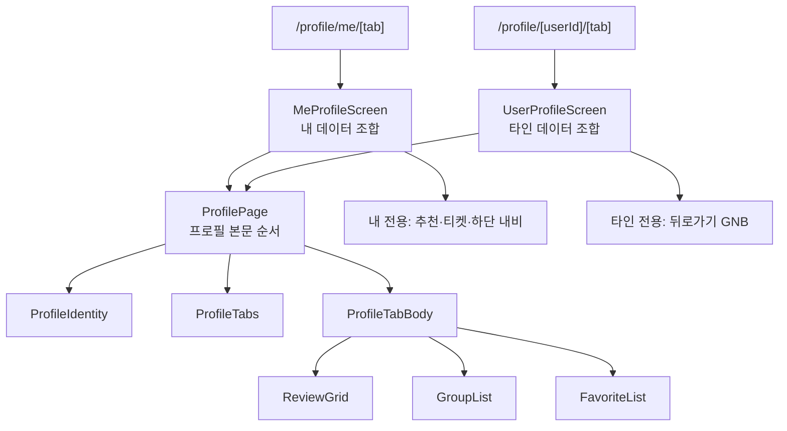
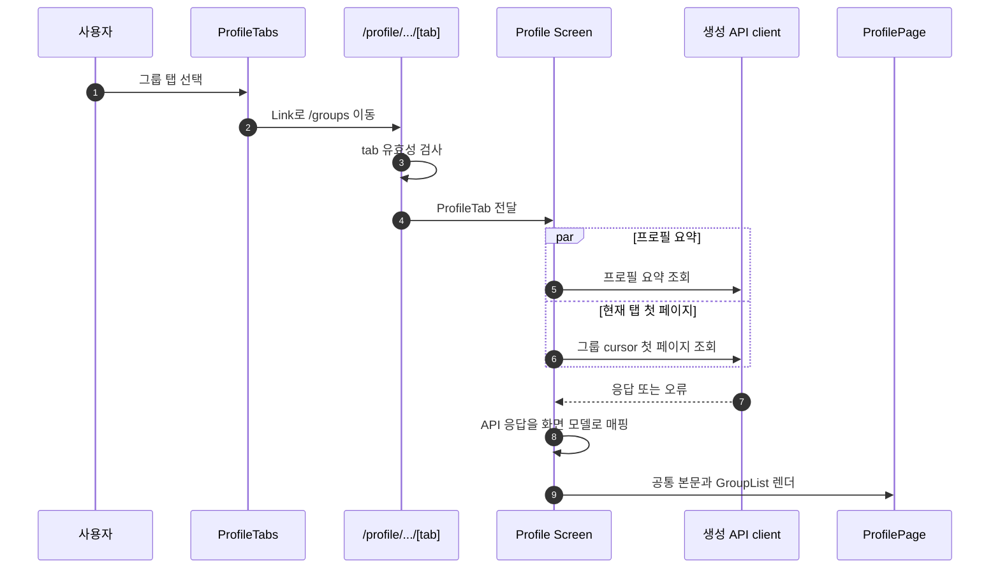
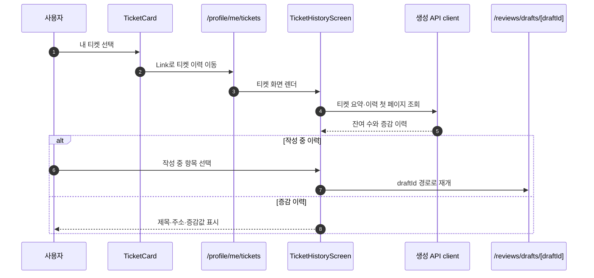
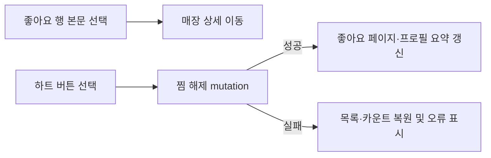

# 프로필 플로우 설계

> 상태: 구현 전 설계
>
> 기준: `feat/#199-mypage` (`0fe59bb`), 2026-08-24
>
> 이 문서는 현재 구현을 설명하지 않는다. Figma와 현재 OpenAPI, 리뷰 작성 플로우 PR #52를 근거로 확정할 프로필 기능의 구조와 정책을 정의한다.

## 1. 목표와 범위

내 프로필과 타인 프로필은 같은 **프로필 정보·탭·탭 본문**을 공유한다. 내 프로필에만 매장 추천, 티켓, 하단 내비게이션이 추가된다. 이 차이를 조건문이 많은 단일 페이지에 몰지 않고, 공통 본문과 두 개의 데이터 Screen이 조합하도록 만든다.

### 화면 근거

| 화면 | Figma 노드 | 설계에 반영한 사실 |
| --- | --- | --- |
| 내 프로필 · 리뷰 | [1674:60952](https://www.figma.com/design/s9CwH81CeRELOPuoWRISzH/TMT---Main?node-id=1674-60952&m=dev) | 프로필, 추천 카드, 티켓 카드, 3개 탭, 리뷰 2열 그리드, 하단 내비게이션 |
| 내 프로필 · 그룹 | [1674:60988](https://www.figma.com/design/s9CwH81CeRELOPuoWRISzH/TMT---Main?node-id=1674-60988&m=dev) | 가입 그룹 목록, 그룹 상세 이동, 저장 매장 일치 배지 |
| 내 프로필 · 좋아요 | [1674:61038](https://www.figma.com/design/s9CwH81CeRELOPuoWRISzH/TMT---Main?node-id=1674-61038&m=dev) | 좋아요한 매장 목록, 매장 상세 이동, 하트 제어 |
| 내 티켓 | [1674:60900](https://www.figma.com/design/s9CwH81CeRELOPuoWRISzH/TMT---Main?node-id=1674-60900&m=dev) | 잔여 티켓, 증감 이력, 작성 중 리뷰 재개 |
| 타인 프로필 · 리뷰 | [1692:24474](https://www.figma.com/design/s9CwH81CeRELOPuoWRISzH/TMT---Main?node-id=1692-24474&m=dev) | 뒤로가기, 이메일 없는 프로필, 같은 3개 탭과 리뷰 그리드 |

### 범위 밖

- Figma에 없는 타인 프로필의 그룹·좋아요 본문은 새 화면 디자인을 만들지 않는다. 같은 탭 계약과 데이터 모델을 준비하되, 세부 시각·상호작용은 해당 노드가 생긴 뒤 검증한다.
- 프로필 편집, 매장 추천, 그룹 상세, 매장 상세, 리뷰 상세 바텀시트 자체는 이 문서의 구현 범위가 아니다. 이 화면은 해당 목적지로의 이동 계약만 가진다.
- 인증 체계와 서버 API 구현은 백엔드 소유다. 프론트는 OpenAPI가 갱신된 뒤 생성 클라이언트만 사용한다.

## 2. 결정

### 2.1 라우트는 프로필 소유로 둔다

```text
src/app/profile/
├── me/
│   ├── page.tsx                     # /profile/me → /profile/me/reviews
│   ├── [tab]/page.tsx               # reviews | groups | favorites
│   └── tickets/page.tsx
├── [userId]/
│   ├── page.tsx                     # /profile/{userId} → /profile/{userId}/reviews
│   └── [tab]/page.tsx               # reviews | groups | favorites
├── _components/
│   ├── MeProfileScreen.tsx
│   ├── UserProfileScreen.tsx
│   ├── ProfilePage.tsx
│   ├── ProfileIdentity.tsx
│   ├── ProfileTabs.tsx
│   ├── ProfileTabBody.tsx
│   ├── ReviewGrid.tsx
│   ├── GroupList.tsx
│   ├── GroupListItem.tsx
│   ├── FavoriteList.tsx
│   ├── FavoriteListItem.tsx
│   ├── TicketCard.tsx
│   ├── TicketHistoryScreen.tsx
│   └── TicketHistoryItem.tsx
├── _hooks/
│   ├── useProfileTabPage.ts
│   └── useTicketHistory.ts
├── _model/
│   └── profile.ts
└── _utils/
    ├── profileTab.ts
    └── profileMappers.ts
```

`me`는 현재 로그인 사용자를 가리키는 예약 경로다. 따라서 실제 `userId`에 `me`를 허용하지 않는다. `me`는 타인 식별자가 아니므로 `/profile/[userId]`와 같은 경계에 섞지 않는다.

`[tab]`은 React 상태나 컴포넌트 이름이 아니라 Next.js의 동적 URL segment다. 각 page는 `params.tab`을 받고 아래 세 값만 `ProfileTab`으로 좁힌다.

```ts
export const PROFILE_TABS = ["reviews", "groups", "favorites"] as const;

export type ProfileTab = (typeof PROFILE_TABS)[number];

export function parseProfileTab(value: string): ProfileTab | null {
  return PROFILE_TABS.find((tab) => tab === value) ?? null;
}
```

유효하지 않은 값은 `notFound()`로 처리한다. 탭을 URL로 소유하면 공유·새로고침·브라우저 뒤로가기에서 선택 상태가 보존되고, 각 탭의 query key가 명시적으로 분리된다. Next.js의 동적 segment와 `params` 사용 방식은 [공식 Dynamic Routes 문서](https://nextjs.org/docs/app/getting-started/layouts-and-pages#dynamic-segments)를 따른다.

### 2.2 공통화는 프로필 본문까지만 한다

공통 컴포넌트는 `ProfilePage` 하나다. 이 컴포넌트는 프로필 정보, 탭, 탭 본문 위치만 책임진다.

```tsx
type ProfilePageProps = {
  profile: ProfileIdentityModel;
  activeTab: ProfileTab;
  basePath: string;
  beforeTabs?: ReactNode;
  children: ReactNode;
};
```

`beforeTabs`는 내 프로필의 추천 카드·티켓 카드가 **프로필과 탭 사이**에 존재한다는 Figma 구조를 표현하는 유일한 확장점이다. header/footer/toolbar 같은 범용 slot API는 만들지 않는다.

| 컴포넌트 | 책임 | 알지 않아야 하는 것 |
| --- | --- | --- |
| `ProfileIdentity` | 아바타, 닉네임, 선택적 이메일 | 현재 사용자 여부, API 응답 |
| `ProfileTabs` | `basePath`로 세 탭 링크를 만들고 활성 탭을 표시 | query, 목록 아이템 |
| `ProfilePage` | Identity → `beforeTabs` → Tabs → children 순서 보장 | GNB, BottomNav, API |
| `ProfileTabBody` | 판별된 탭 모델을 각 전용 본문으로 전달 | 라우팅, API 응답 |
| `MeProfileScreen` | 내 프로필 query·매퍼·내 전용 조합 | 타인 ID 해석 |
| `UserProfileScreen` | 타인 ID query·매퍼·뒤로가기 조합 | 티켓·매장 추천·하단 내비 |

내/타인 차이는 `isMine`, `showTicket`, `showBottomNav` 같은 prop 묶음으로 `ProfilePage`에 전달하지 않는다. 내 화면은 `MyGNB`, 추천 카드, `TicketCard`, `BottomNav`를 조합하고, 타인 화면은 뒤로가기 GNB만 조합한다. 공통 부분은 유지하면서 차이를 숨기지 않는 것이 이 구조의 경계다.



### 2.3 탭 본문은 데이터 형태가 같은 경우에만 공유한다

탭 본문은 하나의 범용 `ListItem`이나 `items` 배열로 만들지 않는다. 리뷰는 2열 이미지 그리드, 그룹은 80px 이미지와 일치 배지, 좋아요는 48px 이미지와 하트 제어를 가진다.

```ts
export type ProfileTabPage =
  | { tab: "reviews"; items: readonly ProfileReviewItem[] }
  | { tab: "groups"; items: readonly ProfileGroupItem[] }
  | { tab: "favorites"; items: readonly ProfileFavoriteItem[] };
```

`ProfileTabBody`의 단일 `switch`가 이 union을 좁힌다. 이후 leaf 컴포넌트는 자기 item 타입만 받는다. 이 분기는 세 화면의 실제 차이를 한 곳에 모으기 위한 것이며, 모든 목록을 하나의 config 배열로 일반화하지 않는다.

```tsx
switch (page.tab) {
  case "reviews":
    return <ReviewGrid reviews={page.items} />;
  case "groups":
    return <GroupList groups={page.items} />;
  case "favorites":
    return <FavoriteList places={page.items} />;
}
```

## 3. 플로우

### 3.1 탭 이동과 데이터 조회

탭은 `button`으로 client state만 바꾸지 않고 `Link`로 sibling route를 연다. `ProfileTabs`는 현재 path를 조립하는 `basePath`만 받아 `reviews`, `groups`, `favorites` 링크를 만든다. Next.js App Router의 링크 prefetch와 동적 route loading UI는 [Linking and Navigating 문서](https://nextjs.org/docs/app/getting-started/linking-and-navigating)를 따른다.



프로필 요약은 탭 전환 중에도 유지한다. 탭 본문만 initial loading, empty, error, next-page loading을 가진다. 이 설계의 목록 조회는 client-side React Query가 소유하므로, 데이터 skeleton은 `ProfileTabBody`가 직접 렌더한다. `loading.tsx`는 서버에서 route data를 기다리게 되는 별도 변경이 생길 때만 검토한다.

### 3.2 티켓 이동과 작성 중 리뷰 재개



PR #52의 `reviews/drafts/[draftId]`는 초안 식별자를 경로로 소유하고, 해당 초안을 읽어 공통 작성 Shell에 주입하는 선례다. 티켓 이력이 `draftId`를 제공할 때만 그 경로로 이동한다. 단순히 “작성 중”이라는 문자열만으로는 이동하지 않는다.

### 3.3 좋아요 해제

현재 Figma는 내 좋아요 목록의 하트와 매장 상세 이동을 동시에 제공한다. 행 전체와 하트는 중첩 interactive element가 되지 않도록 분리한다.



타인 프로필 좋아요 탭의 하트 제어는 Figma 근거가 없다. 해당 탭을 공개하더라도 초기 정책은 읽기 전용이며, viewer가 자신의 좋아요를 바꾸는 control을 추가하려면 별도 디자인과 API 계약이 필요하다.

## 4. 데이터 계약과 매핑 정책

### 4.1 현재 OpenAPI로 가능한 것과 불가능한 것

현재 `src/api/gen/`은 Orval의 `mock: false` 설정으로 생성된 client다. OpenAPI tag 이름에는 `(mock)`이 있으나 프론트 fixture나 마이페이지 응답은 생성하지 않는다.

| 현재 계약 | 재사용 가능성 | 사용하지 않는 이유 또는 한계 |
| --- | --- | --- |
| `GET /v1/home` → `HomeResponse` | 닉네임, `myGroups`의 최소 정보 | 이메일·티켓·탭 카운트·내 리뷰·좋아요가 없고 그룹 설명·일치 수가 부족함 |
| `GET /v1/home/feed` → `CursorPageReviewCardResponse` | 없음 | 가입 그룹에 공유된 피드이며 내 리뷰 목록이 아님 |
| `GET /v1/groups` → `CursorPageGroupCardResponse` | 그룹 행의 필드 모양 | 전체 그룹 탐색 API이며 내 가입 그룹 목록이 아님 |
| `GET /v1/saves` → `CursorPageSaveListItemResponse` | 작성 중 리뷰의 매장·썸네일 후보 | 티켓 증감 이력과 `draftId` 재개 정책을 표현하지 못함 |
| `PlaceCardResponse`, favorite mutation | 좋아요 행의 매장 정보·해제 mutation | 좋아요 목록 endpoint가 없음 |
| `TicketSummary` | 잔여 티켓 수 표현 | 리뷰 저장·그룹 가입 응답에만 포함되고 이력 endpoint가 없음 |

따라서 화면을 `home`, `feed`, `groups` 호출의 조합으로 만들지 않는다. 의미가 다른 목록을 섞으면 필터와 권한 정책이 UI에 새어 나온다.

### 4.2 필요한 OpenAPI 계약

백엔드는 아래 profile resource family를 추가한다. 프론트는 계약 반영 후 `pnpm api:sync`를 실행하고 생성된 client·타입만 사용한다.

| endpoint | 응답 책임 |
| --- | --- |
| `GET /v1/profiles/me` | 내 프로필, 이메일, 탭별 전체 count, 잔여 티켓 수 |
| `GET /v1/profiles/me/{tab}` | 내 리뷰·가입 그룹·좋아요의 cursor 페이지 |
| `GET /v1/profiles/{userId}` | 타인 프로필, 공개 탭별 전체 count |
| `GET /v1/profiles/{userId}/{tab}` | 타인 공개 탭의 cursor 페이지 |
| `GET /v1/profiles/me/tickets` | 티켓 증감 이력, 작성 중 항목의 `draftId?` |

각 목록은 기존 cursor 응답 관례(`items`, `nextCursor`, `hasNext`)를 유지한다. 대표 이미지, 그룹의 `matchedSavedPlaceCount`, 좋아요의 음식 카테고리, 작성 중 티켓의 `draftId`처럼 Figma가 직접 그리는 필드는 서버가 화면 목적에 맞게 내려준다. 프론트가 여러 endpoint를 추가 호출해 조립하지 않는다.

### 4.3 Screen과 ViewModel 경계

생성된 API 타입은 `_components`로 전달하지 않는다. Screen이 `_utils/profileMappers.ts`에서 nullable·누락 필드를 검증해 화면 모델로 바꾼다.

```ts
type ProfileIdentityModel = {
  nickname: string;
  imageUrl: string | null;
  email?: string;
};

type ProfileSummaryModel = {
  profile: ProfileIdentityModel;
  counts: Record<ProfileTab, number>;
  availableTicketCount?: number;
};

type ProfileFavoriteItem = {
  placeId: string;
  name: string;
  roadAddress: string;
  categoryName: string | null;
  thumbnailUrl: string | null;
};
```

필수 식별자나 이름이 없는 item은 mapper에서 제외한다. 타인 프로필은 email과 티켓을 모델에 넣지 않으며, UI에서 `isMine`으로 숨기지 않는다.

### 4.4 cursor와 cache 정책

각 탭 목록은 `useInfiniteQuery`로 조회한다. query key에는 viewer 범위와 tab을 모두 넣는다.

```ts
["profile", "me", tab]
["profile", userId, tab]
["profile", "me", "tickets"]
```

첫 page param은 명시적으로 `null`이고, `getNextPageParam`은 `hasNext`가 참일 때만 `nextCursor`를 반환한다. 자동 다음 페이지 요청은 `hasNextPage && !isFetching`일 때만 수행한다. TanStack Query v5는 explicit `initialPageParam`과 `getNextPageParam`을 요구하며, 이 패턴은 [Infinite Queries 공식 문서](https://tanstack.com/query/latest/docs/framework/react/guides/infinite-queries)와 일치한다.

좋아요 해제 mutation은 해당 좋아요 목록과 내 프로필 요약 query를 함께 갱신한다. 낙관적 갱신을 사용할 경우 이전 `pages`와 `pageParams` 구조를 통째로 보존해 실패 시 그대로 복원한다.

### 4.5 API 계약 전에는 표시 컴포넌트만 선구현한다

현재 OpenAPI에는 profile resource family가 없으므로, API 연동을 기다리는 동안에는 화면 모델을 props로 받는 표시 컴포넌트만 구현할 수 있다. 이 선구현은 Figma 골격·접근성·내/타인 조합 경계를 먼저 고정하기 위한 것이며, 기존 `home`·`feed`·`groups` API를 조합하거나 fixture·MSW 같은 mock 데이터를 추가하는 근거가 아니다.

| 지금 구현 가능 | API 계약 뒤 구현 |
| --- | --- |
| `ProfileIdentity`, `ProfileTabs`, `ProfilePage`, `ProfileTabBody` | `MeProfileScreen`, `UserProfileScreen`의 생성 API query·mapper 연결 |
| `ReviewGrid`, `GroupList`, `FavoriteList`, `TicketCard`, `TicketHistoryItem`의 props 기반 표시·빈 상태 | cursor, loading, error, 재시도, 다음 페이지 조회 |
| `ProfileTab`, `parseProfileTab`, ViewModel 타입 | profile route page, `useInfiniteQuery`, 좋아요 mutation, 티켓 이력 query |

선구현 컴포넌트는 생성 API 타입을 import하지 않고 이 문서의 ViewModel만 받는다. 실제 route page는 API 데이터가 없으므로 만들지 않으며, 컴포넌트를 확인하기 위한 임시 preview route·하드코딩 fixture도 만들지 않는다. OpenAPI 계약이 반영되면 Screen과 mapper를 추가해 선구현 컴포넌트를 연결한다.

## 5. 상태·접근성 정책

| 상태 | 소유자 | 화면 정책 |
| --- | --- | --- |
| 요약 initial loading | 각 Profile Screen | 프로필·탭의 skeleton을 표시하고 이전 사용자 데이터는 보여주지 않음 |
| 탭 initial loading | `ProfileTabBody` | 선택된 탭 본문만 skeleton 표시, 프로필 정보와 탭은 유지 |
| 탭 empty | 각 leaf 목록 | 해당 탭의 빈 상태와 다음 행동을 표시. 다른 탭 count는 유지 |
| 첫 페이지 error | 각 Profile Screen 또는 `ProfileTabBody` | 오류 원인과 재시도 버튼을 표시 |
| 다음 페이지 error | 해당 leaf 목록 | 기존 item은 유지하고 하단에 재시도 control 표시 |
| 좋아요 해제 pending | `FavoriteListItem` | 해당 하트만 disabled·진행 상태, 다른 행은 조작 가능 |

- 탭은 `aria-current="page"`를 갖는 link다. 색 이외에도 현재 URL로 선택 상태가 식별된다.
- 좋아요 행의 상세 이동과 해제 control은 형제 요소다. clickable row 안에 heart button을 넣지 않는다.
- 썸네일 없는 item은 대체 텍스트를 가진 이미지 영역 또는 의미 없는 placeholder로 렌더하며, 이미지 URL을 alt 텍스트로 쓰지 않는다.
- GNB 아이콘, 닫기, 하트에는 접근 가능한 이름을 준다. 기존 `IconButton`을 우선 사용한다.

## 6. 구현 순서와 완료 기준

1. API와 무관한 `ProfileTab`, route parser, ViewModel과 표시 컴포넌트를 구현한다. 기존 `GNB`, `Chip`, `BottomNav`, `IconButton`, icon을 재사용한다.
2. 백엔드가 profile resource family를 OpenAPI에 반영한다.
3. 프론트에서 `pnpm api:sync`로 생성 client와 타입을 갱신한다.
4. `profile/_utils/profileMappers.ts`와 Screen을 추가해 생성 응답을 ViewModel으로 변환한다.
5. 실제 profile route page와 리뷰·그룹·좋아요·티켓 leaf를 연결하고 cursor·loading·empty·error·mutation 정책을 적용한다.
6. Figma 화면별 시각 검증과 `pnpm verify`를 수행한다.

완료로 판단하려면 아래를 모두 만족해야 한다.

- `/profile/me/reviews`, `/groups`, `/favorites`, `/tickets`와 `/profile/{userId}/reviews`가 직접 진입·새로고침·뒤로가기로 올바르게 동작한다.
- 내/타인 공통 본문이 같은 `ProfilePage`를 사용하면서, 내 전용 요소가 타인 화면에 렌더되지 않는다.
- 잘못된 tab은 404이고, `me`는 사용자 ID로 해석되지 않는다.
- 각 탭의 첫 페이지·빈 상태·첫 오류·다음 페이지 오류가 구분된다.
- 좋아요 해제 실패 시 해당 item과 count가 원래 값으로 복원된다.
- 티켓의 작성 중 이력만 유효한 `draftId` 경로로 연결된다.
- Figma export 외의 임의 SVG를 만들지 않으며, 기존 디자인 토큰·공용 primitive를 우선 사용한다.

## 7. 구조 재검토 기록

| 검토안 | 판정 | 근거 |
| --- | --- | --- |
| `/my`에 내 프로필 전용 구현, 타인 프로필 별도 구현 | 기각 | 프로필 정보·탭·리뷰 그리드가 중복되고 이후 그룹·좋아요 변경이 두 경로로 갈라짐 |
| 단일 `ProfileShell`에 `isMine`, `showTicket`, `showBottomNav` 등 variant 누적 | 기각 | 두 화면의 실제 차이를 boolean 조합으로 숨겨 지원하지 않는 상태를 만들기 쉬움 |
| `ProfilePage` + `beforeTabs` 한 자리, 내/타인 Screen 조합 | 채택 | Figma의 공통 본문과 내 전용 삽입 위치를 그대로 드러내며, prop API가 고정됨 |
| 모든 탭 행을 `ProfileListItem`으로 통합 | 기각 | 2열 이미지, 그룹 배지, 하트 mutation의 구조와 접근성 계약이 다름 |
| 탭을 client state로만 관리 | 기각 | 탭마다 다른 목록·cursor query·공유 가능한 URL이 있으므로 route state가 더 정확함 |

이 설계는 세 개의 실제 탭과 두 개의 profile subject만 대상으로 한다. 세 번째 subject 유형이나 두 번째 삽입 위치가 실제로 생기기 전에는 slot 추가, context, 전역 store, 공용 profile feature 계층을 만들지 않는다.

## 참고

- [Next.js App Router: Dynamic Segments](https://nextjs.org/docs/app/getting-started/layouts-and-pages#dynamic-segments)
- [Next.js App Router: Linking and Navigating](https://nextjs.org/docs/app/getting-started/linking-and-navigating)
- [TanStack Query: Infinite Queries](https://tanstack.com/query/latest/docs/framework/react/guides/infinite-queries)
- [PR #52: 리뷰 작성 플로우의 route/screen 선례](https://github.com/mash-up-kr/TMT-FE/pull/52)
- `src/api/gen/`, `_scripts/api/openapi.json`, `src/shared/ui/`, `src/shared/styles/theme.css`
