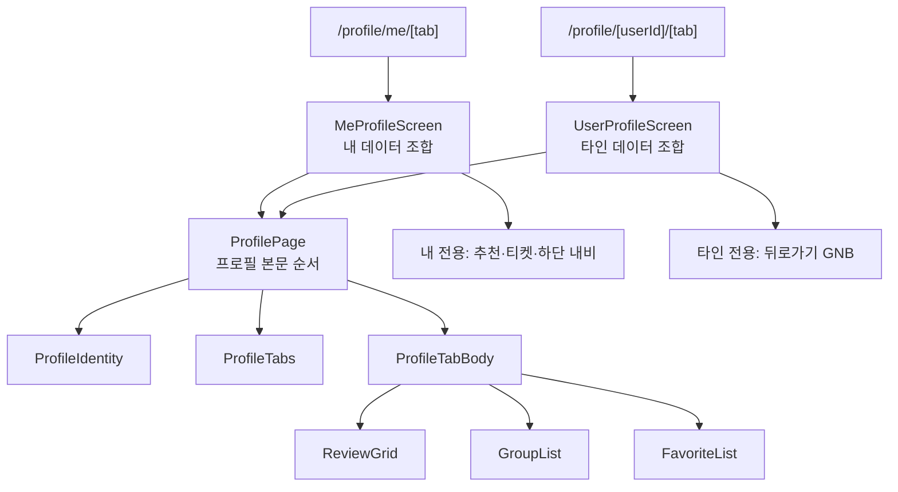
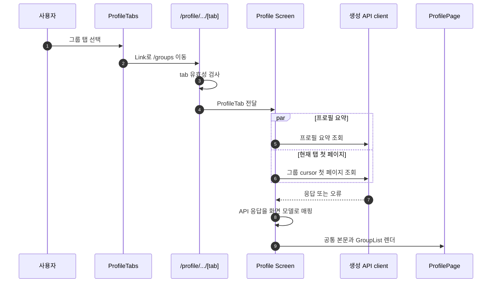
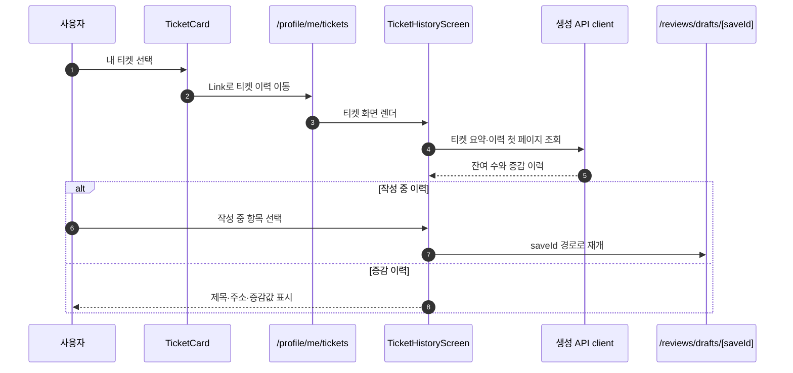
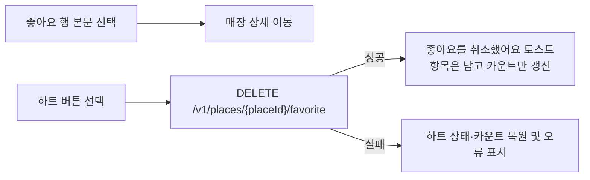

# 프로필 플로우 설계

> 상태: 표시 컴포넌트 구현 완료 · API 연동 대기
>
> 기준: `feat/#199-mypage`, 2026-08-27
>
> 이 문서는 프로필 기능의 **프론트 구조와 경계**를 정한다. API 계약 자체는 [\[설계\] API 명세 v2 — J. 마이페이지 · J-01. 타인 프로필](https://ttalkkak.atlassian.net/wiki/spaces/ttalkkak/pages/59310095)이 정본이고, 여기서 다시 정의하지 않는다.

## 1. 목표와 범위

내 프로필과 타인 프로필은 같은 **프로필 정보·탭·탭 본문**을 공유한다. 내 프로필에만 매장 추천, 티켓, 하단 내비게이션이 추가된다. 이 차이를 조건문이 많은 단일 페이지에 몰지 않고, 공통 본문과 두 개의 데이터 Screen이 조합하도록 만든다.

### 화면 근거

| 화면 | Figma 노드 | 설계에 반영한 사실 |
| --- | --- | --- |
| 내 프로필 · 리뷰 | [1674:60952](https://www.figma.com/design/s9CwH81CeRELOPuoWRISzH/TMT---Main?node-id=1674-60952&m=dev) | 프로필, 추천 카드, 티켓 카드, 3개 탭, 리뷰 2열 그리드, 하단 내비게이션 |
| 내 프로필 · 그룹 | [1674:60988](https://www.figma.com/design/s9CwH81CeRELOPuoWRISzH/TMT---Main?node-id=1674-60988&m=dev) | 가입 그룹 목록, 그룹 상세 이동, 저장 매장 일치 배지 |
| 내 프로필 · 좋아요 | [1674:61038](https://www.figma.com/design/s9CwH81CeRELOPuoWRISzH/TMT---Main?node-id=1674-61038&m=dev) | 좋아요한 매장 목록, 매장 상세 이동, 하트 제어 |
| 내 티켓 | [1674:60900](https://www.figma.com/design/s9CwH81CeRELOPuoWRISzH/TMT---Main?node-id=1674-60900&m=dev) | 잔여 티켓, 증감 이력, 작성 중 리뷰 재개 |
| 타인 프로필 · 리뷰 | [1692:24474](https://www.figma.com/design/s9CwH81CeRELOPuoWRISzH/TMT---Main?node-id=1692-24474&m=dev) | 뒤로가기, 이메일 없는 프로필, 같은 3개 탭과 리뷰 그리드 |

### 범위 밖

- Figma에 없는 타인 프로필의 그룹·좋아요 본문은 새 화면 디자인을 만들지 않는다. 같은 탭 계약과 데이터 모델을 준비하되, 세부 시각·상호작용은 해당 노드가 생긴 뒤 검증한다.
- 프로필 편집, 매장 추천, 그룹 상세, 매장 상세, 리뷰 상세 바텀시트 자체는 이 문서의 구현 범위가 아니다. 이 화면은 해당 목적지로의 이동 계약만 가진다.
- 인증 체계와 서버 API 구현은 백엔드 소유다. 프론트는 OpenAPI가 갱신된 뒤 생성 클라이언트만 사용한다.

## 2. 결정

### 2.1 라우트는 프로필 소유로 둔다

```text
src/app/profile/
├── me/
│   ├── page.tsx                     # /profile/me → /profile/me/reviews
│   ├── [tab]/page.tsx               # reviews | groups | favorites
│   └── tickets/page.tsx
├── [userId]/
│   ├── page.tsx                     # /profile/{userId} → /profile/{userId}/reviews
│   └── [tab]/page.tsx               # reviews | groups | favorites
├── _components/
│   ├── MeProfileScreen.tsx
│   ├── UserProfileScreen.tsx
│   ├── ProfilePage.tsx
│   ├── ProfileIdentity.tsx
│   ├── ProfileTabs.tsx
│   ├── ProfileTabBody.tsx
│   ├── ReviewGrid.tsx
│   ├── GroupList.tsx
│   ├── GroupListItem.tsx
│   ├── FavoriteList.tsx
│   ├── FavoriteListItem.tsx
│   ├── PlaceRecommendationCard.tsx
│   ├── TicketCard.tsx
│   ├── TicketHistoryScreen.tsx
│   ├── TicketHistoryList.tsx
│   └── TicketHistoryItem.tsx
├── _hooks/
│   ├── useProfileTabPage.ts
│   └── useTicketHistory.ts
├── _model/
│   └── profile.ts
└── _utils/
    ├── profileTab.ts
    └── profileMappers.ts
```

`me`는 현재 로그인 사용자를 가리키는 예약 경로다. 따라서 실제 `userId`에 `me`를 허용하지 않는다. `me`는 타인 식별자가 아니므로 `/profile/[userId]`와 같은 경계에 섞지 않는다.

`[tab]`은 React 상태나 컴포넌트 이름이 아니라 Next.js의 동적 URL segment다. 각 page는 `params.tab`을 받고 아래 세 값만 `ProfileTab`으로 좁힌다.

```ts
export const PROFILE_TABS = ["reviews", "groups", "favorites"] as const;

export type ProfileTab = (typeof PROFILE_TABS)[number];

export function parseProfileTab(value: string): ProfileTab | null {
  return PROFILE_TABS.find((tab) => tab === value) ?? null;
}
```

유효하지 않은 값은 `notFound()`로 처리한다. 탭을 URL로 소유하면 공유·새로고침·브라우저 뒤로가기에서 선택 상태가 보존되고, 각 탭의 query key가 명시적으로 분리된다. Next.js의 동적 segment와 `params` 사용 방식은 [공식 Dynamic Routes 문서](https://nextjs.org/docs/app/getting-started/layouts-and-pages#dynamic-segments)를 따른다.

### 2.2 공통화는 프로필 본문까지만 한다

공통 컴포넌트는 `ProfilePage` 하나다. 이 컴포넌트는 프로필 정보, 탭, 탭 본문 위치만 책임진다.

```tsx
type ProfilePageProps = {
  profile: ProfileIdentityModel;
  activeTab: ProfileTab;
  basePath: string;
  beforeTabs?: ReactNode;
  children: ReactNode;
};
```

`beforeTabs`는 내 프로필의 추천 카드·티켓 카드가 **프로필과 탭 사이**에 존재한다는 Figma 구조를 표현하는 유일한 확장점이다. header/footer/toolbar 같은 범용 slot API는 만들지 않는다.

| 컴포넌트 | 책임 | 알지 않아야 하는 것 |
| --- | --- | --- |
| `ProfileIdentity` | 아바타, 닉네임, 선택적 이메일 | 현재 사용자 여부, API 응답 |
| `ProfileTabs` | `basePath`로 세 탭 링크를 만들고 활성 탭을 표시 | query, 목록 아이템 |
| `ProfilePage` | Identity → `beforeTabs` → Tabs → children 순서 보장 | GNB, BottomNav, API |
| `ProfileTabBody` | 판별된 탭 모델을 각 전용 본문으로 전달 | 라우팅, API 응답 |
| `MeProfileScreen` | 내 프로필 query·매퍼·내 전용 조합 | 타인 ID 해석 |
| `UserProfileScreen` | 타인 ID query·매퍼·뒤로가기 조합 | 티켓·매장 추천·하단 내비 |

내/타인 차이는 `isMine`, `showTicket`, `showBottomNav` 같은 prop 묶음으로 `ProfilePage`에 전달하지 않는다. 내 화면은 `MyGNB`, 추천 카드, `TicketCard`, `BottomNav`를 조합하고, 타인 화면은 뒤로가기 GNB만 조합한다. 공통 부분은 유지하면서 차이를 숨기지 않는 것이 이 구조의 경계다.



### 2.3 탭 본문은 데이터 형태가 같은 경우에만 공유한다

탭 본문은 하나의 범용 `ListItem`이나 `items` 배열로 만들지 않는다. 리뷰는 2열 이미지 그리드, 그룹은 80px 이미지와 일치 배지, 좋아요는 48px 이미지와 하트 제어를 가진다.

```ts
export type ProfileTabPage =
  | { tab: "reviews"; items: readonly ProfileReviewItem[] }
  | { tab: "groups"; items: readonly ProfileGroupItem[] }
  | { tab: "favorites"; items: readonly ProfileFavoriteItem[] };
```

`ProfileTabBody`의 단일 `switch`가 이 union을 좁힌다. 이후 leaf 컴포넌트는 자기 item 타입만 받는다. 이 분기는 세 화면의 실제 차이를 한 곳에 모으기 위한 것이며, 모든 목록을 하나의 config 배열로 일반화하지 않는다.

내/타인 차이는 leaf가 `isMine` 같은 boolean으로 알지 않는다. 타인 화면에서 사라지는 것은 **control과 배지**이므로, 해당 prop을 주지 않으면 렌더되지 않는 형태로 표현한다 — 좋아요 행은 `onUnfavorite`가 없으면 하트를 그리지 않고, 그룹 행은 `matchedSavedPlaceCount`가 없으면 일치 칩을 그리지 않는다.

```tsx
switch (page.tab) {
  case "reviews":
    return <ReviewGrid reviews={page.items} />;
  case "groups":
    return <GroupList groups={page.items} />;
  case "favorites":
    return <FavoriteList places={page.items} />;
}
```

## 3. 플로우

### 3.1 탭 이동과 데이터 조회

탭은 `button`으로 client state만 바꾸지 않고 `Link`로 sibling route를 연다. `ProfileTabs`는 현재 path를 조립하는 `basePath`만 받아 `reviews`, `groups`, `favorites` 링크를 만든다. Next.js App Router의 링크 prefetch와 동적 route loading UI는 [Linking and Navigating 문서](https://nextjs.org/docs/app/getting-started/linking-and-navigating)를 따른다.



프로필 요약은 탭 전환 중에도 유지한다. 탭 본문만 initial loading, empty, error, next-page loading을 가진다. 이 설계의 목록 조회는 client-side React Query가 소유하므로, 데이터 skeleton은 `ProfileTabBody`가 직접 렌더한다. `loading.tsx`는 서버에서 route data를 기다리게 되는 별도 변경이 생길 때만 검토한다.

### 3.2 티켓 이동과 작성 중 리뷰 재개



PR #52의 `reviews/drafts/[draftId]`는 저장 식별자를 경로로 소유하고, 해당 저장을 읽어 공통 작성 Shell에 주입하는 선례다. 계약이 내려주는 핸들은 `saveId`이며(§4-1), 이력 항목이 `saveId`를 제공할 때만 그 경로로 이동한다. 단순히 “작성 중”이라는 문자열만으로는 이동하지 않는다.

### 3.3 좋아요 해제

행 전체와 하트는 중첩 interactive element가 되지 않도록 분리한다.

해제해도 **항목은 목록에서 즉시 사라지지 않는다.** 취소를 되돌릴 수 있어야 하므로 다음 조회에서 빠진다 (계약 §3-3). 따라서 목록에서 item을 제거하는 낙관적 갱신을 하지 않는다. 갱신 대상은 하트 상태와 프로필 요약의 `favoritePlaceCount`다.



타인 프로필 좋아요 탭에는 **하트가 없다** (계약 §6-1). 읽기 전용이며, 응답의 `isFavorite`는 조회자 기준이라 `true`가 아닐 수 있다.

## 4. 데이터 계약과 매핑 정책

### 4.1 계약 정본

계약 정본은 Confluence [\[설계\] API 명세 v2 — J. 마이페이지 · J-01. 타인 프로필](https://ttalkkak.atlassian.net/wiki/spaces/ttalkkak/pages/59310095)(장민서, v6, 2026-08-23)이다. 공통 응답 래퍼·에러·커서 규약은 [공통 API 규약 v1](https://ttalkkak.atlassian.net/wiki/spaces/ttalkkak/pages/51249170)을 따른다.

이 문서는 계약을 다시 정의하지 않는다. 화면 구조와 프론트 경계만 정하고, 필드와 응답 형태는 계약을 가리킨다. 계약과 이 문서가 어긋나면 계약이 정본이다.

계약은 아직 OpenAPI에 반영되지 않았다. `pnpm api:sync`는 백엔드가 스펙으로 발행한 것만 가져오므로, 배포 전에는 생성 client가 나오지 않는다.

### 4.2 endpoint

| # | 메서드 · 경로 | 화면 | 인증 |
| --- | --- | --- | --- |
| 1 | `GET /v1/users/me` | 프로필 · 배너 2종 · 칩 카운트 | 필수 |
| 2 | `GET /v1/users/me/reviews` | 리뷰 탭 · 매장 추천 진입 격자 | 필수 |
| 3 | `GET /v1/users/me/groups` | 그룹 탭 | 필수 |
| 4 | `GET /v1/users/me/favorites` | 좋아요 탭 | 필수 |
| 5 | `GET /v1/users/me/tickets` | 내 티켓 | 필수 |
| 6 | `POST /v1/recommendations/places` | 매장 추천받기 | 필수 |
| 7 | `GET /v1/users/{userId}` | 타인 프로필 · 칩 카운트 | 선택 |
| 8 | `GET /v1/users/{userId}/reviews` | 타인 리뷰 탭 | 선택 |
| 9 | `GET /v1/users/{userId}/groups` | 타인 그룹 탭 | 선택 |
| 10 | `GET /v1/users/{userId}/favorites` | 타인 좋아요 탭 | 선택 |

탭은 `{tab}` 동적 세그먼트가 아니라 **탭마다 별개 경로**다. 라우트의 `[tab]`은 URL 세그먼트일 뿐이고, 호출할 endpoint는 Screen이 탭 값으로 고른다.

찜 토글은 마이페이지 전용 endpoint를 두지 않고 `PUT`·`DELETE /v1/places/{placeId}/favorite`를 그대로 쓴다.

목록 항목은 기존 스키마를 재사용한다 — 그룹 탭은 `GroupCardResponse`, 좋아요 탭은 `PlaceCardResponse`다. 새 응답 타입을 만들지 않는다.

**마이페이지는 전 구간 인증 필수**이고, **타인 프로필은 인증 선택**이다. 비로그인이면 조회자 기준 필드가 각각 `0`(`matchedSavedPlaceCount`) · `false`(`isFavorite`)로 내려온다.

### 4.3 Screen과 ViewModel 경계

생성된 API 타입은 `_components`로 전달하지 않는다. Screen이 `_utils/profileMappers.ts`에서 nullable·누락 필드를 검증해 화면 모델로 바꾼다. 화면 모델의 필드 이름은 계약 응답을 그대로 따라 매핑 지점을 눈에 보이게 둔다.

```ts
type ProfileIdentityModel = {
  nickname: string;
  profileImageUrl: string | null;
  email?: string;
};

type ProfileSummaryModel = {
  profile: ProfileIdentityModel;
  counts: Record<ProfileTab, number>;   // reviewCount / joinedGroupCount / favoritePlaceCount
  availableTicketCount?: number;        // 내 프로필만
};
```

목록 항목은 계약이 재사용하라고 지정한 스키마를 따른다.

| 탭 | 계약 응답 | 화면 모델 |
| --- | --- | --- |
| 리뷰 | `reviewId` · `saveId?` · `thumbnailUrl` · `place{placeId,name,categoryName?}` · `createdAt` | `ProfileReviewItem` |
| 그룹 | `GroupCardResponse` | `ProfileGroupItem` |
| 좋아요 | `PlaceCardResponse` | `ProfileFavoriteItem` |

리뷰 항목의 `saveId`는 **소유자에게만 내려온다.** 내 프로필은 `saveId`로 본인 상세를, 타인 프로필은 `reviewId`로 리뷰 상세를 연다. 화면 모델도 이 갈래를 그대로 갖는다.

필수 식별자나 이름이 없는 item은 mapper에서 제외한다. 타인 프로필은 email과 티켓을 모델에 넣지 않으며, UI에서 `isMine`으로 숨기지 않는다.

#### 티켓 이력 항목

한 목록에 발급·소비·회수와 미완성 저장이 시각 역순으로 섞인다. 구분은 `amount`의 `null` 여부이고, **행의 출처는 매장 · 그룹 · 둘 다 없음 세 가지다.** `SIGNUP_REWARD`는 매장도 그룹도 없다.

```ts
type TicketEntrySource =
  | { kind: "place"; placeId: string; name: string; roadAddress: string }
  | { kind: "group"; groupId: string; name: string }
  | { kind: "none" };

type ProfileTicketHistoryItem = {
  entryId: string;
  type: TicketEntryType;
  source: TicketEntrySource;
  occurredAt: string;
} & (
  | { status: "inProgress"; saveId: string }   // amount === null
  | { status: "settled"; amount: number }
);
```

`status`는 `amount`의 `null` 여부로 정한다. 재개 핸들은 `saveId`이고, 없으면 이동하지 않는다. "작성 중"이라는 표시만으로 이동시키지 않기 위해 상태와 식별자를 한 갈래로 묶는다.

### 4.4 cursor와 cache 정책

각 탭 목록은 `useInfiniteQuery`로 조회한다. query key에는 viewer 범위와 tab을 모두 넣는다.

```ts
["profile", "me", tab]
["profile", userId, tab]
["profile", "me", "tickets"]
```

첫 page param은 명시적으로 `null`이고, `getNextPageParam`은 `hasNext`가 참일 때만 `nextCursor`를 반환한다. 자동 다음 페이지 요청은 `hasNextPage && !isFetching`일 때만 수행한다. TanStack Query v5는 explicit `initialPageParam`과 `getNextPageParam`을 요구하며, 이 패턴은 [Infinite Queries 공식 문서](https://tanstack.com/query/latest/docs/framework/react/guides/infinite-queries)와 일치한다.

좋아요 해제 mutation은 **목록에서 item을 제거하지 않는다**(§3.3). 하트 상태와 내 프로필 요약의 `favoritePlaceCount`만 갱신하고, 실패하면 둘 다 되돌린다.

좋아요 탭과 매장 추천 격자는 위치를 선택적으로 받는다. `latitude`·`longitude`를 주면 응답의 `distanceMeters`가 채워지고, 안 주면 비어 온다. 위치는 화면 필수 조건이 아니다.

### 4.5 OpenAPI 반영 전에는 fixture로 화면을 그린다

계약은 확정됐고 OpenAPI 반영만 남았다. 그동안 `_fixtures/`의 계약 응답으로 화면을 그린다. architecture rule의 Mock 정책이 허용하는 예외이며, 조건은 그 문서에 있다.

**fixture는 화면 모델이 아니라 계약 응답 모양으로 쓴다.** 그래야 `profileMappers.ts`를 지금 작성해 연동 후 그대로 쓸 수 있다.

```text
route page  →  Screen  →  _hooks/useProfileData  →  profileMappers  →  ViewModel  →  표시 컴포넌트
                          ^^^^^^^^^^^^^^^^^^^^^^
                          연동 시 교체하는 유일한 지점
```

연동 시 하는 일은 네 가지다.

1. `pnpm api:sync`
2. `_fixtures/contract.ts`의 손으로 쓴 응답 타입을 생성 타입 import로 교체
3. `_hooks/useProfileData.ts`의 `queryFn`을 생성 client 호출로 교체하고, 목록은 `useInfiniteQuery`로 바꾼다
4. `_fixtures/` 삭제

Screen·mapper·컴포넌트·라우트는 건드리지 않는다. 손으로 쓴 응답 타입과 생성 타입이 어긋나면 2단계에서 타입 에러가 나는 것이 정상이고, 그 자리가 곧 고칠 자리다.

fixture로 덮지 않는 것도 있다. 매장 추천(`POST /v1/recommendations/places`)은 화면이 없어 배너를 이동하지 않는 상태로 두고, 좋아요 해제는 서버 호출 없이 토스트와 pending 상태만 재현한다.

## 5. 상태·접근성 정책

| 상태 | 소유자 | 화면 정책 |
| --- | --- | --- |
| 요약 initial loading | 각 Profile Screen | 프로필·탭의 skeleton을 표시하고 이전 사용자 데이터는 보여주지 않음 |
| 탭 initial loading | `ProfileTabBody` | 선택된 탭 본문만 skeleton 표시, 프로필 정보와 탭은 유지 |
| 탭 empty | 각 leaf 목록 | 해당 탭의 빈 상태와 다음 행동을 표시. 다른 탭 count는 유지 |
| 첫 페이지 error | 각 Profile Screen 또는 `ProfileTabBody` | 오류 원인과 재시도 버튼을 표시 |
| 다음 페이지 error | 해당 leaf 목록 | 기존 item은 유지하고 하단에 재시도 control 표시 |
| 좋아요 해제 pending | `FavoriteListItem` | 해당 하트만 disabled·진행 상태, 다른 행은 조작 가능. 성공해도 item은 목록에 남는다 |

- 탭은 `aria-current="page"`를 갖는 link다. 색 이외에도 현재 URL로 선택 상태가 식별된다.
- 좋아요 행의 상세 이동과 해제 control은 형제 요소다. clickable row 안에 heart button을 넣지 않는다.
- 썸네일 없는 item은 대체 텍스트를 가진 이미지 영역 또는 의미 없는 placeholder로 렌더하며, 이미지 URL을 alt 텍스트로 쓰지 않는다.
- GNB 아이콘, 닫기, 하트에는 접근 가능한 이름을 준다. 기존 `IconButton`을 우선 사용한다.
- 타인 프로필에서는 하트와 일치 칩을 **렌더하지 않는다.** 비활성 control을 두지 않는다.

## 6. 구현 순서와 완료 기준

1. `ProfileTab`, route parser, ViewModel과 표시 컴포넌트를 구현한다. 기존 `GNB`, `Chip`, `BottomNav`, `IconButton`, `Badge`, `EmptyNotice`, icon을 재사용한다.
2. 백엔드가 계약을 OpenAPI에 반영하고 배포한다.
3. 프론트에서 `pnpm api:sync`로 생성 client와 타입을 갱신한다.
4. `profile/_utils/profileMappers.ts`와 Screen을 추가해 생성 응답을 ViewModel으로 변환한다.
5. 실제 route page와 리뷰·그룹·좋아요·티켓 leaf를 연결하고 cursor·loading·empty·error·mutation 정책을 적용한다.
6. 매장 추천(격자 8칸 + `＋`, `POST /v1/recommendations/places`)을 붙인다.
7. Figma 화면별 시각 검증과 `pnpm verify`를 수행한다.

완료로 판단하려면 아래를 모두 만족해야 한다.

- `/profile/me/reviews`, `/groups`, `/favorites`, `/tickets`와 `/profile/{userId}/reviews`가 직접 진입·새로고침·뒤로가기로 올바르게 동작한다.
- 내/타인 공통 본문이 같은 `ProfilePage`를 사용하면서, 내 전용 요소가 타인 화면에 렌더되지 않는다.
- 잘못된 tab은 404이고, `me`는 사용자 ID로 해석되지 않는다.
- 각 탭의 첫 페이지·빈 상태·첫 오류·다음 페이지 오류가 구분된다.
- 좋아요 해제 성공 시 item은 남고 카운트만 줄며, 실패 시 하트와 카운트가 원래 값으로 복원된다.
- 티켓 이력이 매장·그룹·출처 없음 세 행을 모두 그리고, `saveId`가 있는 항목만 이동한다.
- 타인 프로필의 그룹 탭에 일치 칩이, 좋아요 탭에 하트가 렌더되지 않는다.
- Figma export 외의 임의 SVG를 만들지 않으며, 기존 디자인 토큰·공용 primitive를 우선 사용한다.

## 7. 구조 재검토 기록

| 검토안 | 판정 | 근거 |
| --- | --- | --- |
| `/my`에 내 프로필 전용 구현, 타인 프로필 별도 구현 | 기각 | 프로필 정보·탭·리뷰 그리드가 중복되고 이후 그룹·좋아요 변경이 두 경로로 갈라짐 |
| 단일 `ProfileShell`에 `isMine`, `showTicket`, `showBottomNav` 등 variant 누적 | 기각 | 두 화면의 실제 차이를 boolean 조합으로 숨겨 지원하지 않는 상태를 만들기 쉬움 |
| `ProfilePage` + `beforeTabs` 한 자리, 내/타인 Screen 조합 | 채택 | Figma의 공통 본문과 내 전용 삽입 위치를 그대로 드러내며, prop API가 고정됨 |
| 모든 탭 행을 `ProfileListItem`으로 통합 | 기각 | 2열 이미지, 그룹 배지, 하트 mutation의 구조와 접근성 계약이 다름 |
| 탭을 client state로만 관리 | 기각 | 탭마다 다른 목록·cursor query·공유 가능한 URL이 있으므로 route state가 더 정확함 |

### 7.1 계약 대조로 바뀐 것 (2026-08-27)

BE 계약을 확인하기 전에는 필요한 endpoint를 추정해 적어뒀다. 실제 계약과 대조해 아래를 고쳤다.

| 항목 | 추정 | 계약 |
| --- | --- | --- |
| 경로 | `/v1/profiles/*` | `/v1/users/*` |
| 탭 조회 | `{tab}` 동적 세그먼트 하나 | 탭마다 별개 경로 |
| 목록 항목 | 프로필 전용 응답 | `GroupCardResponse` · `PlaceCardResponse` 재사용 |
| 티켓 재개 핸들 | `draftId` | `saveId` |
| 티켓 이력 출처 | 매장 고정 | 매장 · 그룹 · 없음 세 갈래 |
| 좋아요 해제 | 목록에서 제거 후 실패 시 복원 | 목록에 남기고 다음 조회에서 제외 |
| 타인 프로필 하트 | Figma 근거 없어 읽기 전용으로 추정 | 하트 자체를 렌더하지 않음 (계약 §6-1) |
| 매장 추천 | 이동 계약만 | `POST /v1/recommendations/places` + 격자 8칸 |

구조 결정(상단 고정 + 탭별 페이징, 카운트를 상단 응답에 싣기, `ProfilePage` 공통 골격, 탭을 URL로 소유, 식별자 있을 때만 이동)은 계약과 어긋나지 않아 그대로 둔다.

### 7.2 기각안

이 설계는 세 개의 실제 탭과 두 개의 profile subject만 대상으로 한다. 세 번째 subject 유형이나 두 번째 삽입 위치가 실제로 생기기 전에는 slot 추가, context, 전역 store, 공용 profile feature 계층을 만들지 않는다.

## 참고

- [Next.js App Router: Dynamic Segments](https://nextjs.org/docs/app/getting-started/layouts-and-pages#dynamic-segments)
- [Next.js App Router: Linking and Navigating](https://nextjs.org/docs/app/getting-started/linking-and-navigating)
- [TanStack Query: Infinite Queries](https://tanstack.com/query/latest/docs/framework/react/guides/infinite-queries)
- [\[설계\] API 명세 v2 — J. 마이페이지 · J-01. 타인 프로필](https://ttalkkak.atlassian.net/wiki/spaces/ttalkkak/pages/59310095) — 계약 정본
- [공통 API 규약 v1](https://ttalkkak.atlassian.net/wiki/spaces/ttalkkak/pages/51249170)
- [도메인 설계 v2](https://ttalkkak.atlassian.net/wiki/spaces/ttalkkak/pages/57049090)
- [PR #52: 리뷰 작성 플로우의 route/screen 선례](https://github.com/mash-up-kr/TMT-FE/pull/52)
- `src/api/gen/`, `_scripts/api/openapi.json`, `src/shared/ui/`, `src/shared/styles/theme.css`
