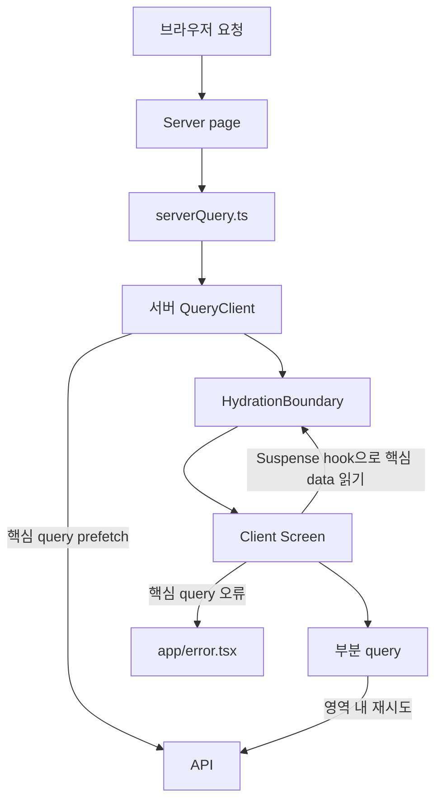
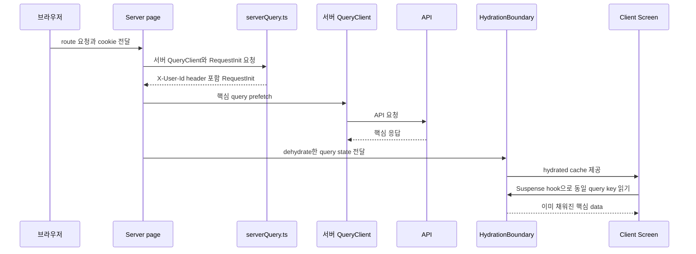
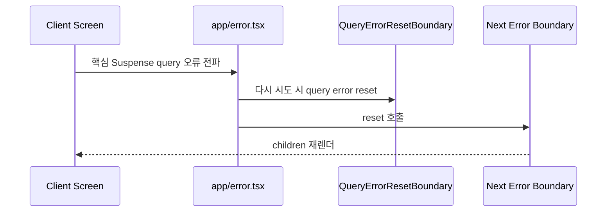

# Next.js Suspense · Error Boundary 사용 가이드

핵심 화면 데이터는 서버에서 prefetch한 뒤 `HydrationBoundary`로 전달하고, 화면은 Suspense hook으로 그린다. 화면 일부 데이터는 일반 TanStack Query와 영역 안의 재시도 UI로 남긴다.

## 이 문서에서 꼭 읽을 것

- **핵심 query 기준:** 데이터가 없으면 화면의 정체성이나 기본 행동이 성립하지 않는 경우만 Suspense로 만든다.
- **서버 사용자 기준:** 서버 prefetch 요청은 `tmt-mock-user-id` cookie를 `X-User-Id` header로 변환한다.
- **재시도 순서:** `app/error.tsx`는 Query error reset 후 Next boundary `reset()`을 호출한다.
- **부분 query 기준:** 조건부·무한 목록·피드·리뷰·가입 미리보기는 일반 query로 남기고 해당 영역만 재시도한다.
- **생성 범위:** Orval Suspense hook은 `home`, `groupDetail`, `placeDetail` 세 operation에만 생성한다.
- **하단 탭:** PR #85의 `AppChrome`은 route children의 sibling이므로 route loading/error fallback 중에도 남는다.

> 대상: 로컬 작업 트리 `feat/#212-error-boundary`의 미커밋 구현  
> 비교 기준: `feat/#215-bottomnav-app-shell` (PR #85)  
> `` `NEW` ``: 비교 기준 대비 추가·변경된 구현

## 1. AS-IS → TO-BE

**기존에는 Screen이 핵심 query의 대기·오류를 직접 분기했고, 이제는 서버 prefetch와 route boundary가 핵심 query를 맡는다.**

### AS-IS

- `QueryProvider`는 browser QueryClient만 만들었다.
- `mutator.ts`는 브라우저에서 `localStorage` mock ID를 읽고, 서버에서는 환경 변수 기본 ID를 반환했다.
- 홈은 `HomeScreen`에서 `useHomeSummary()`의 `isPending`, `isError`, `refetch`를 직접 처리했다.
- 가게 상세와 그룹 상세도 Screen 또는 query-state hook에서 핵심 data의 pending/error를 직접 처리했다.
- `app/loading.tsx`, `app/error.tsx`, `app/global-error.tsx`가 없었다.

### TO-BE

- `` `NEW` `` `serverQuery.ts`가 cookie에서 사용자 ID를 읽고, 서버 전용 QueryClient와 `RequestInit`을 만든다.
- `` `NEW` `` 홈·가게 상세·그룹 상세 `page.tsx`가 핵심 query를 `prefetchQuery()`하고 `HydrationBoundary`로 전달한다.
- `` `NEW` `` 세 화면은 Orval Suspense hook을 읽는다. 핵심 data의 `isPending`/`isError` 분기가 사라진다.
- `` `NEW` `` `loading.tsx`가 route fallback을 제공하고, `app/error.tsx`가 핵심 query 실패를 받는다.
- `` `NEW` `` 부분 query는 `RetryNotice`에서 자기 `refetch()`만 호출한다.

| 관점 | AS-IS | TO-BE |
| --- | --- | --- |
| 사용자 ID | browser localStorage, 서버 기본값 | browser·server가 같은 cookie 값 사용 |
| 핵심 데이터 요청 | Client Screen mount 후 query 실행 | server page prefetch 후 hydration |
| 핵심 실패 | 화면별 `isError` 분기 | `app/error.tsx` fallback |
| 대기 UI | 화면별 spinner | 기본 route spinner 또는 route 전용 skeleton |
| 부분 실패 | 화면별 임의 UI | `RetryNotice` + 해당 query `refetch()` |

## 2. 컴포넌트 구성

**서버 준비, route boundary, Screen 데이터 소비의 책임을 서로 섞지 않는다.**

| 구성 요소 | 책임 | 현재 사용처 |
| --- | --- | --- |
| `serverQuery.ts` | cookie → 요청 header, 서버 QueryClient | 홈·가게 상세·그룹 상세 page |
| `page.tsx` | 핵심 query prefetch, dehydrated state 전달 | 홈·가게 상세·그룹 상세 |
| private Suspense hook | API response를 화면 model로 변환해 소비 | 홈 요약, 가게 상세, 그룹 상세 |
| `loading.tsx` | route segment의 Suspense fallback | 앱 기본, 홈, 가게 상세, 그룹 상세 |
| `app/error.tsx` | 핵심 실패 재시도·홈 이동 | 모든 route child |
| `RetryNotice` | 부분 실패 메시지와 local refetch | 홈 피드, 가게 리뷰, 그룹 리뷰·가입 정보, 프로필 |

## 3. 핵심 데이터 성공 흐름

**핵심 query는 서버가 먼저 채우고, Client Screen은 같은 query key의 hydrated cache를 읽는다.**

현재 핵심 흐름은 다음 세 route다.

| route | 서버 prefetch | Client hook |
| --- | --- | --- |
| `/` | `getHomeQueryOptions()` | `useSuspenseHomeSummary()` |
| `/places/[placeId]` | `getPlaceDetailQueryOptions()` | `useSuspensePlaceDetail()` |
| `/groups/[groupId]` | `getGroupDetailQueryOptions()` | `useSuspenseGroupDetail()` |

## 4. 실패 처리

**핵심 실패와 부분 실패는 같은 fallback을 쓰지 않는다.**

### 핵심 query 실패

`app/error.tsx`는 `useQueryErrorResetBoundary().reset()`을 호출한 뒤 Next `reset()`을 호출한다. 하단 탭 경로가 아닌 경우에만 `홈으로` 버튼을 렌더링한다.

`global-error.tsx`는 root layout 자체가 실패했을 때 별도 문서 구조로 렌더링되며, 새로고침과 홈 링크만 제공한다.

### 부분 query 실패

부분 query는 throw하지 않는다. 현재 구현은 다음처럼 local retry를 갖는다.

- 홈 피드: `HomeFeed` → `RetryNotice` → feed `refetch()`
- 가게 리뷰: `PlaceReviews` → `RetryNotice` → reviews `refetch()`
- 그룹 리뷰: `GroupReviewList`의 `error` state → `RetryNotice`
- 가입 미리보기: `GroupDetailView` 본문 영역의 `RetryNotice`
- 프로필 탭: 기존 `ProfileQueryFallback`이 `RetryNotice`를 사용

그룹 상세의 data model은 핵심 그룹 data와 가입 미리보기를 분리한다. 그룹 API는 `GroupDetailViewData`를 만들고, `joinPreview`는 `pending`·`error`·`ready` 상태를 별도로 가진다. 따라서 가입 정보를 못 받아도 그룹 프로필과 리뷰 영역은 남는다.

## 5. 다음 핵심 화면을 전환하는 방법

**아래 조건을 모두 만족할 때만 Suspense + server prefetch 패턴을 적용한다.**

1. 데이터가 없으면 화면의 제목·핵심 행동·본문을 만들 수 없는지 확인한다.
2. OpenAPI operation ID에 Orval `useSuspenseQuery: true`를 추가한다.
3. route `page.tsx`에서 `getXxxQueryOptions()`와 `getServerRequestInit()`으로 `prefetchQuery()`를 실행한다.
4. Screen은 route private `useSuspenseXxx()` hook을 통해 hydrated data를 읽는다.
5. route segment에 `loading.tsx`를 추가한다. 데이터 없이도 확정되는 header가 있으면 fallback에 포함한다.
6. 목록·검색·무한 query·`enabled`가 필요한 query는 일반 query로 남기고 `RetryNotice` 또는 기존 loading UI를 사용한다.

추가 helper가 필요한지 판단하는 기준도 단순하다. 현재 prefetch는 각 page에서 같은 다섯 줄을 반복한다. 네 번째 이상의 실제 사용처가 생기기 전까지는 범용 prefetch helper를 만들지 않는다.

## 6. mock 사용자와 실제 인증

현재 구현은 실제 인증이 아니라 서버 prefetch 검증을 위한 mock 사용자 선택이다.

- `setMockUserId()`는 browser에서 `tmt-mock-user-id` cookie를 쓴다.
- `getServerRequestInit()`은 같은 cookie를 읽어 `X-User-Id`로 전달한다.
- `tmtFetch()`는 caller가 `X-User-Id`를 주지 않은 경우에만 browser cookie 또는 기본값을 넣는다.
- UT2 preview는 사용자를 바꾼 뒤 `window.location.assign()`으로 홈을 다시 연다.

실제 인증 cookie의 이름·전달 방식·CORS 정책은 이 코드에 구현돼 있지 않다. 인증이 도입되면 `serverQuery.ts`와 `mutator.ts`의 사용자 header 변환 경계를 검토한다.

## 7. 변경 파일 요약

| 영역 | 변경 |
| --- | --- |
| API 생성 | 핵심 operation 3개만 Suspense hook 생성 |
| 서버 데이터 | `serverQuery.ts`, 각 핵심 route의 prefetch/hydration |
| 전역 fallback | `app/loading.tsx`, `app/error.tsx`, `app/global-error.tsx` |
| 화면 fallback | 홈·가게·그룹 route loading, `Skeleton`, `RetryNotice` |
| 부분 상태 | 홈 피드·가게 리뷰·그룹 리뷰·가입 미리보기·프로필 fallback |
| mock 사용자 | localStorage → cookie, UT2 전체 이동 |
| 구조 규칙 | `.claude/rules/architecture.md`에 server query 경계 추가 |

## 코드 근거

- `src/api/mutator.ts`
- `src/shared/providers/serverQuery.ts`
- `src/shared/providers/QueryProvider.tsx`
- `src/app/loading.tsx`, `src/app/error.tsx`, `src/app/global-error.tsx`
- `src/app/(home)/page.tsx`, `src/app/places/[placeId]/page.tsx`, `src/app/groups/[groupId]/page.tsx`
- `src/app/(home)/_hooks/useHomeSummary.ts`
- `src/app/places/[placeId]/_hooks/usePlaceDetail.ts`
- `src/app/groups/[groupId]/_hooks/useGroupDetailQueryState.ts`
- `src/shared/ui/RetryNotice.tsx`, `src/shared/ui/Skeleton.tsx`
